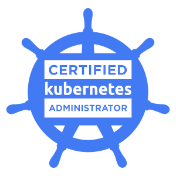
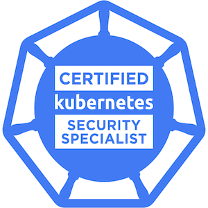
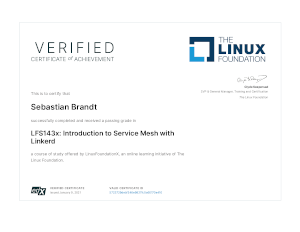

# About me

more to come

# Certificates

[][BadgeCKA]
[][BadgeCKS]
[][edXLinkerd]

<!--
**sebbrandt87/sebbrandt87** is a ✨ _special_ ✨ repository because its `README.md` (this file) appears on your GitHub profile.

Here are some ideas to get you started:

- 🔭 I’m currently working on ...
- 🌱 I’m currently learning ...
- 👯 I’m looking to collaborate on ...
- 🤔 I’m looking for help with ...
- 💬 Ask me about ...
- 📫 How to reach me: ...
- 😄 Pronouns: ...
- ⚡ Fun fact: ...
-->

[BadgeCKA]: https://www.credly.com/badges/544d0db3-5764-4e88-9c29-04a702da5fd2
[BadgeCKS]: https://www.credly.com/badges/0a5b67dc-1d4f-4e57-aeae-80fe414b4744
[edXLinkerd]: https://courses.edx.org/certificates/5723729debf546e9827fc0a60170e410
